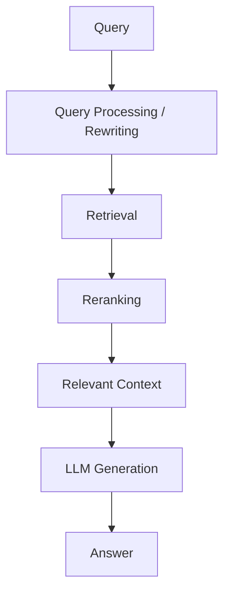
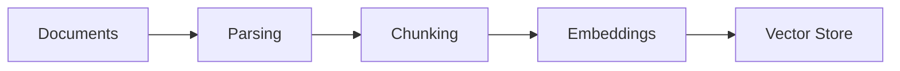
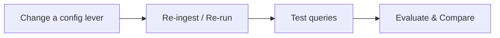
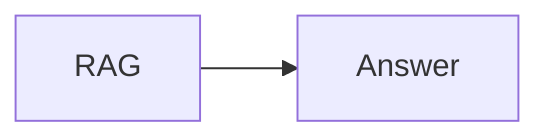
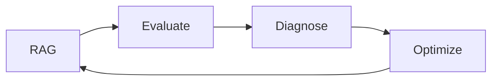
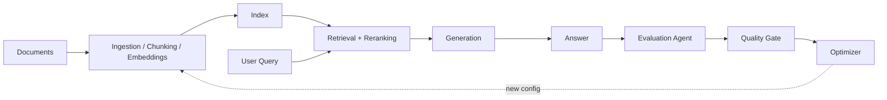
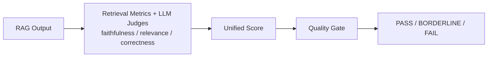

<!-- _class: lead -->

# Self-Improving RAG
## From Retrieval to Continuous Optimization

Traditional RAG → RAG failures → Manual trial-and-error → **Self-Improving RAG**

---

## Slide 1 — RAG and the Problem We Are Solving

**What is RAG?**  Query → Retrieval → Context → LLM → Answer



**Ingestion path** (runs before any query):



> RAG quality is **not** determined only by the LLM — it depends on decisions across the entire system, from ingestion through retrieval to generation.

---

## Slide 1 (cont.) — Where Can RAG Go Wrong?

| Ingestion failures | Retrieval failures | Generation failures |
|---|---|---|
| Poor document parsing | Relevant chunks not retrieved | Answer not grounded in context |
| Incorrect/inconsistent chunking | Too many irrelevant chunks | Answer incomplete |
| Chunk size too small/large | Poor query formulation | LLM misunderstands retrieved info |
| Context split across chunks | Incorrect top-K | Hallucination |
| Poor metadata | Poor ranking/reranking | Prompt/configuration problems |
| Embedding/model mismatch | Ineffective hybrid search config | |
| Missing/incomplete documents | | |

> **A RAG failure can happen almost anywhere — from ingestion all the way through retrieval and generation.**

---

## Slide 2 — Why RAG Optimization Is Difficult

Manual experimentation, repeated for every lever — chunk size, retrieval strategy, reranker, prompt/top-K — each one its own **change → re-ingest/re-run → test → compare** cycle:



**Cycle:** Hypothesis → Configuration Change → Re-ingestion/Execution → Evaluation → Comparison

**The problem** — expensive in time and compute/LLM cost, and hard to answer:
- Which part of the system caused the failure? Which config should change?
- Did the change actually improve quality — or just shift the cost/latency trade-off?
- Which configuration should we keep? When do we stop optimizing?

---

## Slide 2 (cont.) — The Self-Improving RAG Idea

Instead of a static pipeline:



We introduce an **evaluation and optimization feedback loop**:



The Optimizer uses evaluation results to decide what to change; the system re-runs evaluation to confirm the new configuration is actually better.

> Not simply **"get the highest quality score"** — it's **"find a better RAG configuration while balancing quality, cost, and latency."**

---

## Slide 3 — End-to-End Closed Loop



The gate checks three things together — **Quality Score · Cost · Latency**:

| Quality Gate outcome | Condition | Result |
|---|---|---|
| **PASS** | Score ≥ 0.85 | Accept configuration |
| **BORDERLINE** | 0.70 ≤ Score < 0.85 | Human review |
| **FAIL** | Score < 0.70 or Faithfulness < 0.50 | Optimizer proposes a new configuration, loop repeats |

---

## Slide 3 (cont.) — Evaluation Agent, Zoomed In

*(Verified against `agents/evaluator.py`, `pipeline.py`, `utils.py`, `config.py` — the two guide documents disagreed on weights; the formula below is what the code actually runs.)*



**Worked example — the numbers behind the score above:**

| Signal | Value |
|---|---|
| Retrieval recall | 0.72 |
| Faithfulness | 0.82 |
| Relevance | 0.91 |
| Correctness | 0.75 |
| Latency | 1400 ms |
| Cost | $0.004 |
| **Unified Score** | **0.803 → BORDERLINE (human review)** |

> The Evaluator converts multiple dimensions of RAG performance into measurable signals the Optimizer can act on.

---

## Evaluation Metrics

| Metric | What it measures | Example |
|---|---|---|
| **Faithfulness** (LLM judge) | Are the answer's claims supported by the retrieved context? | Answer says "policy expires after 3 years" and context confirms 3 years → 0.82 |
| **Answer Relevancy** (LLM judge) | Does the answer address the question asked? | User asks about warranty period → answer discusses warranty, not unrelated details → 0.91 |
| **Correctness** (LLM judge, golden queries only) | Does the answer match the expected ground-truth answer? | Golden Q&A pair exists → compared directly → 0.75 |
| **Retrieval Recall/Precision** (keyword, no LLM) | Did retrieval find and prioritize the right chunks? | 4 of 5 top-k chunks contain the needed keywords → 0.72 |
| **Cost** | Generation LLM cost only (judges are eval overhead) | $0.004 per query, capped at $0.01 → penalty 0.020 |
| **Latency** | Generation LLM call time only (not judge time) | 1400 ms, saturates at 3000 ms → penalty 0.047 |

Faithfulness, Relevancy, Correctness, Recall → **quality**. Cost & Latency → **operational efficiency**.

---

## Unified Score and Quality Gate — Actual Formula

```text
quality  = 0.6 × correctness + 0.4 × relevance         (falls back to relevance alone if no ground truth)

score    = 0.25 × recall
         + 0.35 × quality
         + 0.25 × faithfulness
         − 0.10 × min(latency_ms / 3000, 1)
         − 0.05 × min(cost_usd / 0.01, 1)
```

If a positive signal is missing, its weight is dropped and the remaining weights are re-normalized to sum to 0.85 (the penalty budget is untouched) — so missing data never fabricates a score.

**Worked example** (matches the diagram above):

| Signal | Value |
|---|---|
| Retrieval recall | 0.72 |
| Quality (0.6×0.75 + 0.4×0.91) | 0.814 |
| Faithfulness | 0.82 |
| Latency penalty (1400/3000 × 0.10) | −0.047 |
| Cost penalty (0.004/0.01 × 0.05) | −0.020 |
| **Unified Score** | **0.25×0.72 + 0.35×0.814 + 0.25×0.82 − 0.047 − 0.020 ≈ 0.803** |

**Gate decision** (`utils.compute_gate_decision`, thresholds in `config.py`):

| Condition | Decision | Outcome |
|---|---|---|
| Faithfulness < 0.50 | `hard_block` | Safety veto — non-negotiable, checked first |
| Unified score ≥ 0.85 | `deploy_eligible` | Autonomous accept |
| 0.70 ≤ Unified score < 0.85 | `hitl_required` | Human approval needed |
| Unified score < 0.70 | `hard_block` | Triggers Diagnoser → Improver loop |

→ In the worked example, **0.803** with faithfulness 0.82 lands in **`hitl_required`**.

---

<!-- _class: lead -->

## Key Message

Traditional RAG: **Build → Test → Manually Tune → Repeat**

Self-Improving RAG: **Build → Evaluate → Diagnose → Optimize → Re-evaluate → Accept the Best Configuration**

RAG quality becomes something that can be **measured, analyzed, and continuously improved — while balancing cost and latency.**
