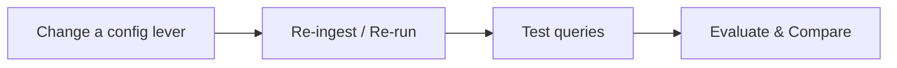
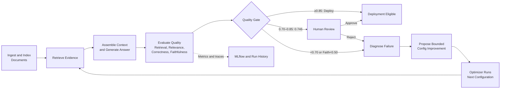
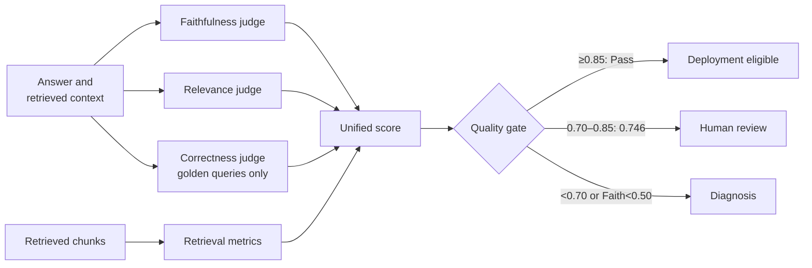

<!-- _class: lead -->

# Self-Improving RAG
## From Retrieval to Continuous Optimization (v1)

Traditional RAG → RAG failures → Manual trial-and-error → **Self-Improving RAG**

---

## 1. Purpose

A RAG (Retrieval-Augmented Generation) pipeline answers questions by retrieving
relevant text from documents and passing it to a language model to generate a
grounded answer. Getting one working is easy. Getting one that retrieves the
right passages, does not hallucinate, and stays reliable normally takes manual
tuning.

RAG quality is **not** decided by the LLM alone — it depends on two pipelines
working together: how documents are prepared for search (**ingestion**), and
how relevant evidence is found and handed to the LLM (**retrieval**).

---

## 1. Purpose — Ingestion vs. Retrieval

**Ingestion Pipeline** (offline, once per document set):


**Retrieval Pipeline** (online, once per query):


Ingestion runs **once per document set** (offline). Retrieval runs **once per query** (online) — but it depends entirely on what ingestion produced.

---

## 1. Purpose — Where It Works, Where It Fails

| Stage | Works well when | Fails when |
|---|---|---|
| **Ingestion** | Clean parsing, sensible chunk boundaries, embeddings match the domain | Poor parsing, chunk size too small/large, context split across chunks, poor metadata, embedding/model mismatch, missing documents |
| **Retrieval** | Query is well-formed, top-k is tuned, reranking/hybrid search is effective | Poor query formulation, wrong top-k, relevant chunks not retrieved, too many irrelevant chunks, ineffective hybrid config |
| **Generation** | Context is sufficient and relevant, prompt is clear | Answer not grounded in context, hallucination, incomplete answer, LLM misreads context, prompt/config problems |

> **A RAG failure can happen almost anywhere — from ingestion all the way through retrieval and generation.** This is why Self-Improving RAG evaluates and can adjust configuration at every one of these stages, not just the prompt.

---

## 2. Why RAG Optimization Is Difficult

Manual experimentation, repeated for every lever — chunk size, retrieval strategy, reranker, prompt/top-K — each one its own **change → re-ingest/re-run → test → compare** cycle:



**Cycle:** Hypothesis → Configuration Change → Re-ingestion/Execution → Evaluation → Comparison

**The problem** — expensive in time and compute/LLM cost, and hard to answer:
- Which part of the system caused the failure? Which config should change?
- Did the change actually improve quality — or just shift the cost/latency trade-off?
- Which configuration should we keep? When do we stop optimizing?

Self-Improving RAG replaces this manual cycle with the closed-loop system below.

---

## 3. End-to-End Flow



The evaluation-to-optimization loop is the central capability: a low-quality result becomes an observable, repeatable configuration experiment instead of trial and error.

---

## 4. The Evaluator Agent — Zoomed In

*(From `Self_Improving_RAG_Guide.md`, Part IV — verified against the actual code in `evaluator.py` / `pipeline.py` / `utils.py`.)*



---

## 4. Evaluator Agent — Worked Example

| Signal | What it means | Value |
|---|---|---|
| Retrieval recall | Did retrieval find the chunks needed to answer the question? | 0.90 |
| Relevance | Does the answer address the question asked? | 0.95 |
| Correctness (golden query) | Does the answer match the expected ground-truth answer? | 0.92 |
| Quality = 0.6×Correctness + 0.4×Relevance | Blended answer-quality sub-score | 0.932 |
| Faithfulness | Are the answer's claims supported by the retrieved context? | 0.90 |
| Latency | How long the generation call took | 600 ms → penalty 0.020 |
| Cost | LLM generation cost for this query | $0.002 → penalty 0.010 |

```text
Unified Score = 0.25×0.90 + 0.35×0.932 + 0.25×0.90 − 0.020 − 0.010
              = 0.225 + 0.3262 + 0.225 − 0.030
              ≈ 0.746
```

**Gate decision:** Faithfulness 0.90 ≥ 0.50 (no veto) and Score 0.746 falls in **[0.70, 0.85)** → **`hitl_required`** (human review).

---

<!-- _class: lead -->

## Key Message

Traditional RAG: **Build → Test → Manually Tune → Repeat**

Self-Improving RAG: **Build → Evaluate → Diagnose → Optimize → Re-evaluate → Accept the Best Configuration**

RAG quality becomes something that can be **measured, analyzed, and continuously improved — while balancing cost and latency.**
