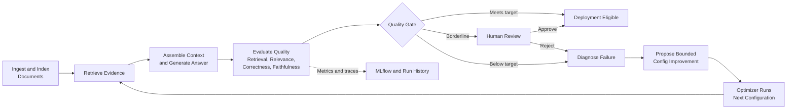

# Self-Improving RAG Architecture Overview

## Purpose

A RAG (Retrieval-Augmented Generation) pipeline answers questions by retrieving
relevant text from documents and passing it to a language model to generate a
grounded answer. Getting one working is easy. Getting one that retrieves the
right passages, does not hallucinate, and stays reliable normally takes manual
tuning.

Self-Improving RAG automates that tuning loop. It ingests and indexes documents,
retrieves evidence, generates an answer, evaluates the result, diagnoses poor
outcomes, proposes a bounded improvement, and evaluates the next configuration.

## End-to-End Flow

The evaluation-to-optimization loop is the central capability. It turns a low
quality result into an observable, repeatable configuration experiment rather
than leaving tuning to trial and error.

## Components

| Component | Role | Output |
|---|---|---|
| Ingestor | Loads documents, creates chunks, embeds them, and stores them in versioned Chroma collections. | Searchable collection |
| Retriever | Embeds the question and returns the top-$k$ relevant chunks. | Ranked evidence chunks |
| Generator | Fits retrieved chunks into the context budget and asks the LLM for a grounded answer. | Answer and generation metadata |
| Evaluator | Scores retrieval, faithfulness, relevance, and, for golden queries, correctness. | Unified score and quality gate |
| HITL | Requests a human decision for borderline results. | Approved or rejected result |
| Diagnoser | Classifies the main reason a result underperformed. | Failure type and remediation hint |
| Improver | Applies a safe, deterministic configuration delta from its playbook. | Candidate next configuration |
| Optimizer | Runs bounded iterations and keeps the best observed outcome. | Optimization report |
| MLflow | Records experiment parameters, metrics, and execution traces. | Comparable run history |

## Quality Controls

- **Grounding:** Faithfulness checks whether answer claims are supported by the
  retrieved context. A low faithfulness score is a hard safety block.
- **Evaluation:** The unified score combines retrieval quality, answer quality,
  faithfulness, latency, and cost.
- **Bounded improvement:** The Optimizer only changes validated configuration
  knobs and stops on success, review, a safety block, no progress, or its
  iteration budget.

## Current Scope

The current demo uses a Canadian workplace-policy corpus and a golden dataset of
single-source, two-source, and three-source questions. It supports versioned
ingestion, dense Chroma retrieval, answer generation, evaluation, human review,
optimization, Streamlit inspection, JSONL history, and MLflow experiment
tracking.

## Planned Phase 2 Retrieval Enhancements

- Query Rewriter for ambiguous or underspecified questions
- Hybrid search combining keyword and dense retrieval
- Reranking before context assembly
- Context compression for large retrieved evidence sets

These are planned enhancements, not active stages in the current pipeline.