# Self-Improving RAG: Technical Guide

**Version**: v1.0 | **Audience**: ML/AI Engineers, Data Engineers, Technical Reviewers

---

## Table of Contents

- [Chapter 1: Introduction](#chapter-1-introduction)
- [Chapter 2: Architecture at a Glance](#chapter-2-architecture-at-a-glance)
- [Chapter 3: Core Concepts](#chapter-3-core-concepts)
- [Chapter 4: The Agent Flow](#chapter-4-the-agent-flow)
  - [Agent 1: Pipeline Agent](#agent-1-pipeline-agent)
  - [Agent 2: Evaluator (How the Pipeline Is Scored)](#agent-2-evaluator-how-the-pipeline-is-scored)
  - [Agent 3: Diagnoser (Why a Pipeline Underperforms)](#agent-3-diagnoser-why-a-pipeline-underperforms)
  - [Agent 4: Improver (Applying a Targeted Fix)](#agent-4-improver-applying-a-targeted-fix)
- [Chapter 5: The Optimizer Loop](#chapter-5-the-optimizer-loop)
- [Chapter 6: Using the Streamlit UI](#chapter-6-using-the-streamlit-ui)
- [Chapter 7: Configuration and Ingestion](#chapter-7-configuration-and-ingestion)
- [Chapter 8: Troubleshooting and FAQ](#chapter-8-troubleshooting-and-faq)

---

# Chapter 1: Introduction

### What Problem It Solves

A RAG pipeline answers questions by retrieving relevant text from documents and passing it to a
language model. Getting one working is straightforward. Getting one that retrieves the *right*
passages, doesn't hallucinate, and improves itself when it fails. That requires a structured
evaluation and improvement loop.

This system implements that loop: **evaluate** the pipeline's output, **diagnose** why it
underperforms, **improve** the configuration, and **re-evaluate**, in a controlled manner,
bounded by configurable iteration limits, before escalating to a human reviewer.

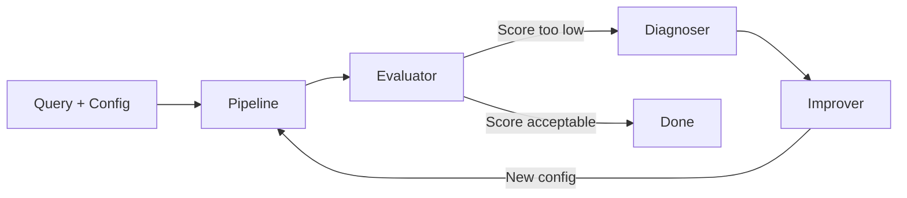

### System Overview

Self-Improving RAG is an end-to-end RAG system with autonomous quality control. It implements
five core agents, each with a single responsibility, orchestrated as a LangGraph state machine:

| Agent | Responsibility |
|-------|---------------|
| **Pipeline** | Retrieves chunks, assembles context, generates an answer |
| **Evaluator** | Grades the answer (faithfulness, relevance, correctness) and determines the gate decision |
| **Diagnoser** | Classifies the root cause of underperformance (one of 5 failure types) |
| **Improver** | Proposes a specific configuration change based on the diagnosis |
| **Optimizer** | Orchestrates the improvement loop: baseline → trial iterations → convergence |

### Roadmap

The current release covers the core evaluation and self-improvement loop. The following
capabilities are planned for subsequent phases:

| Capability | Status |
|-----------|--------|
| Evaluate → Diagnose → Improve loop | Implemented |
| HITL (Human-in-the-Loop) gate | Implemented |
| Automated ingestion and re-ingestion | Implemented |
| Production deployment (canary/blue-green rollout) | Planned for Phase 2 |
| Live monitoring and alerting (Observer agent) | Planned for Phase 2 |
| F-06 Quality Drift detection | Planned for Phase 2 |
| MLflow experiment tracking | Planned for Phase 3 |
| Prometheus/Grafana metrics dashboard | Planned for Phase 3 |
| Audit logging and compliance trail | Planned for Phase 3 |

[Back to Top](#table-of-contents)

---

# Chapter 2: Architecture at a Glance

### Two-Layer Design

The system uses a two-layer architecture that separates a single evaluation attempt (the graph)
from retry orchestration (the optimizer):

### Layer 1: The Graph (single pass)

Each graph invocation runs the full pipeline once: retrieve → generate → evaluate → route.
The graph never loops internally. It produces a result and exits.

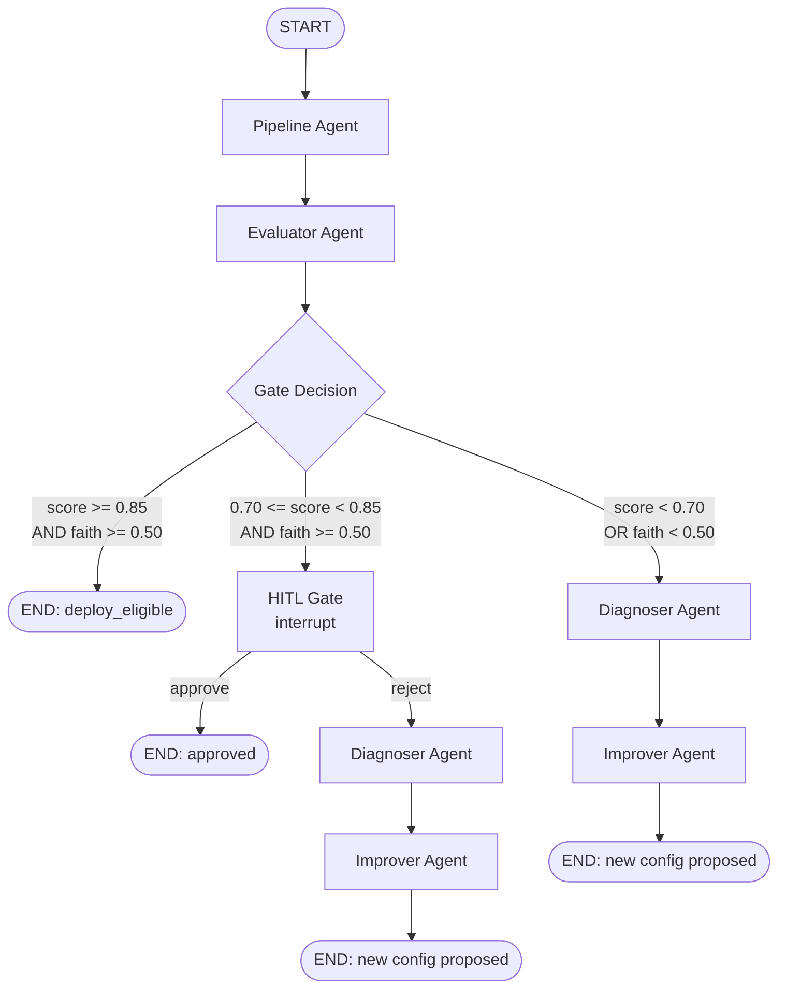

### Layer 2: The Optimizer (external loop)

The Optimizer sits outside the graph and controls retries. It invokes the graph repeatedly,
extracting the Improver's suggested configuration after each iteration and feeding it as the
next iteration's input.

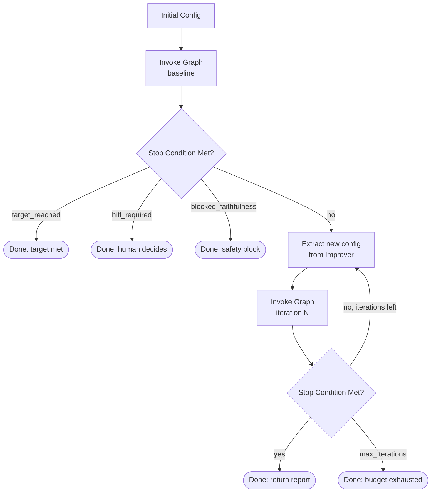

### Why Linear, Not Circular

A circular graph (where the Improver loops back to the Pipeline Agent) risks infinite loops
and makes debugging harder. The linear design means each graph invocation is a pure function:
same input → same output. The Optimizer owns the retry logic and applies its own stop
conditions between iterations.

[Back to Top](#table-of-contents)

---

# Chapter 3: Core Concepts

### Unified Score

A single number (0 to 1) that answers: *"Overall, how good is this pipeline?"*

It blends five components using a weighted formula:

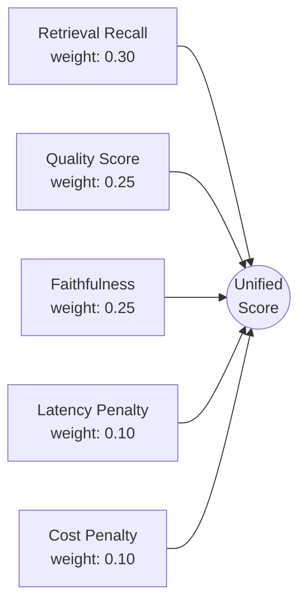

```
unified = 0.30 * recall_score
        + 0.25 * quality_score
        + 0.25 * faithfulness
        + 0.10 * latency_penalty
        + 0.10 * cost_penalty
```

Where:
- **recall_score**: keyword-based retrieval precision/recall (no LLM call)
- **quality_score**: average of relevance and correctness (LLM judge)
- **faithfulness**: are claims grounded in the retrieved context? (LLM judge)
- **latency_penalty**: 1.0 if fast, decreasing if slow (saturates at 3000ms)
- **cost_penalty**: 1.0 if cheap, decreasing with cost

### Gate Decision

The Evaluator uses the unified score and faithfulness to produce a gate decision:

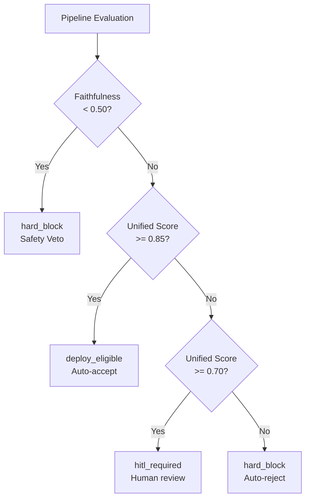

| Unified Score | Faithfulness | Decision |
|---------------|-------------|----------|
| >= 0.85 | >= 0.50 | `deploy_eligible` (autonomous acceptance) |
| 0.70 - 0.84 | >= 0.50 | `hitl_required` (requires human approval) |
| < 0.70 | (any) | `hard_block` (rejected, triggers improvement loop) |
| (any) | < 0.50 | `hard_block` (safety veto, non-negotiable) |

**The faithfulness veto is non-negotiable.** A pipeline that scores 0.90 overall but
hallucinates (faithfulness < 0.50) is blocked. High quality scores never excuse invented facts.

### Failure Types (F-01 to F-05)

When the gate blocks a pipeline, the Diagnoser classifies the root cause:

| Code | Name | Trigger | Meaning |
|------|------|---------|---------|
| F-01 | Retrieval Miss | No chunks retrieved or retrieval_score < 0.30 | Failed to find relevant passages |
| F-02 | Context Overflow | Context fills 95%+ of token budget | Retrieved too much, relevant material was truncated |
| F-03 | Hallucination | faithfulness < 0.50 | Answer contains claims not supported by the context |
| F-04 | Answer Incomplete | (catch-all) | Retrieved relevant material but the answer didn't use it |
| F-05 | Latency Spike | latency > 3000ms | Response time exceeds the acceptable threshold |

**Priority order matters.** The Diagnoser checks F-03 first (safety), then F-01, F-02, F-05,
and F-04 last (catch-all). First match wins. This prevents a hallucinating pipeline from being
misdiagnosed as merely "slow."

> **F-06 (Quality Drift)**, detecting score degradation over time across production traffic,
> is planned for Phase 2, alongside the Observer agent and live monitoring capabilities.
> The configuration scaffolding (`DRIFT_WINDOW`, `DRIFT_MIN_DROP`) is already defined.

### LLM Judges

Three separate LLM calls evaluate the pipeline's output. The judge model is architecturally
independent from the generation model, allowing them to be swapped or scaled separately:

| Judge | What it scores | Scale |
|-------|---------------|-------|
| Faithfulness | Are all claims in the answer supported by the retrieved context? | 0.0 - 1.0 |
| Relevance | Does the answer address the question asked? | 0.0 - 1.0 |
| Correctness | Does the answer match the expected ground truth answer? | 0.0 - 1.0 |

Correctness runs only when ground truth exists for the query (from the golden dataset). For
ad-hoc questions, it is skipped.

[Back to Top](#table-of-contents)

---

# Chapter 4: The Agent Flow

This chapter traces data through each agent: what it receives, what it does, and what it
returns. Each agent is implemented as a LangGraph node with a defined state contract.

### Workflow at a Glance

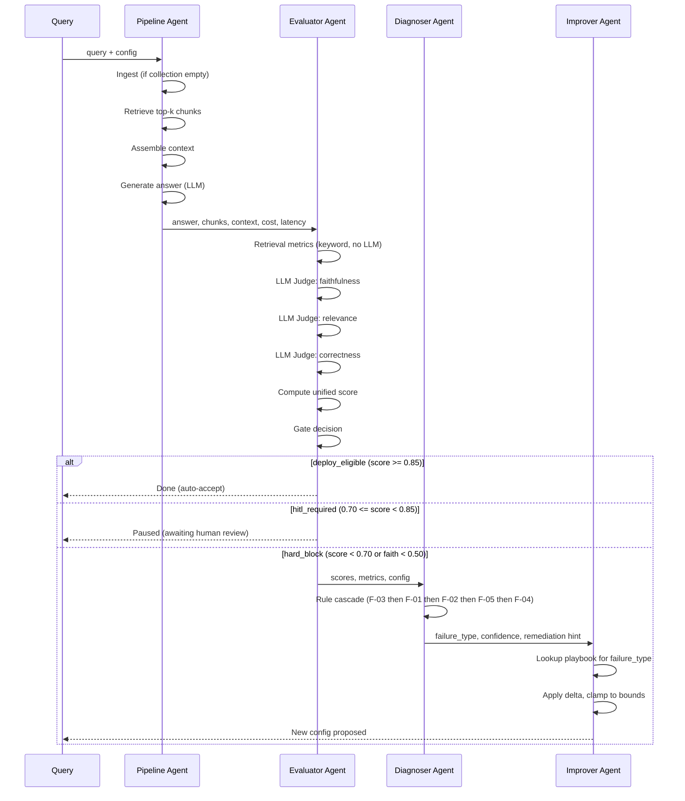

---

### Agent 1: Pipeline Agent

**File:** `agents/graph.py`, `pipeline_node()`

**Input:** query, config (chunk_size, retrieval_k, etc.), version

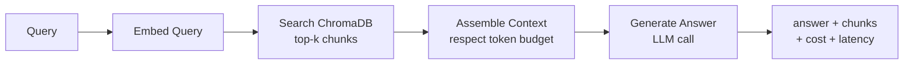

**Process:**
1. Build collection name: `rag_{version}_{strategy}_{chunk_size}`
2. Auto-ingest if collection is empty (chunk the corpus, embed, store in ChromaDB)
3. Embed the query, search ChromaDB for top-k chunks
4. Assemble context from retrieved chunks (respecting `max_context_tokens`)
5. Generate answer using the LLM with the assembled context + query

**Output:** answer, retrieved_chunks, context, context_tokens, latency_ms, cost_usd

---

### Agent 2: Evaluator (How the Pipeline Is Scored)

**File:** `agents/evaluator.py`, `evaluator_node()`

The Evaluator executes **5 jobs** in sequence. Two are free (no LLM), three require LLM judge calls:

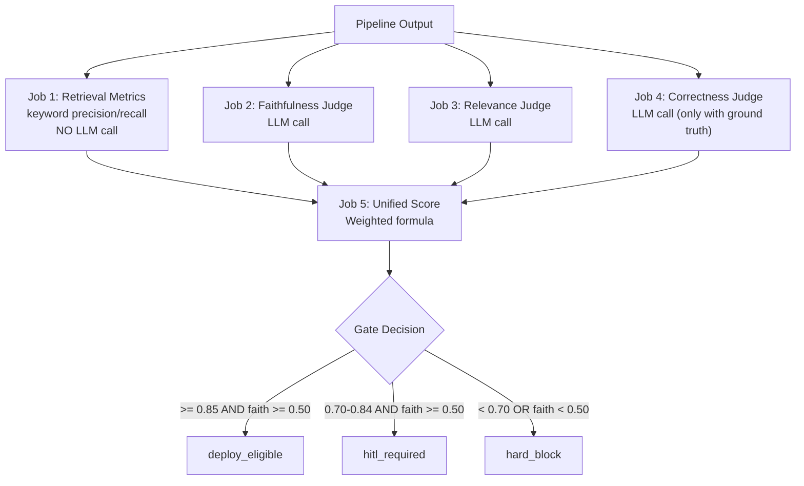

**Input:** query, answer, context, retrieved_chunks, config, latency_ms, cost_usd

**The 5 Jobs:**

| # | Job | LLM? | What it computes |
|---|-----|------|-----------------|
| 1 | Retrieval Metrics | No | Keyword precision@k and recall@k against ground truth keywords |
| 2 | Faithfulness Judge | Yes | "How many claims in the answer are supported by the context?" |
| 3 | Relevance Judge | Yes | "Does the answer address the question asked?" |
| 4 | Correctness Judge | Yes* | "Does the answer match the expected answer?" |
| 5 | Unified Score | No | Weighted formula combining all metrics → gate decision |

*Correctness only runs when ground truth exists for the query.

**Why this order matters:** Retrieval metrics are computed first because they are free and
instant. The three LLM judges run next (each is a separate API call). The unified score
is computed last because it requires all preceding inputs.

**Output:** unified_score, faithfulness, relevance, correctness, gate_decision, gate_reason,
judge_reasoning

---

### Agent 3: Diagnoser (Why a Pipeline Underperforms)

**File:** `agents/diagnoser.py`, `diagnoser_node()`

The Diagnoser activates only when the gate blocks a pipeline. It applies a **deterministic
rule cascade** with no LLM call. First matching rule wins.

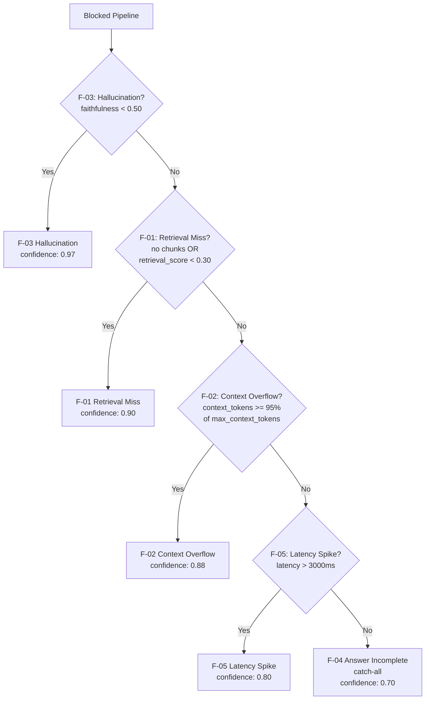

**Input:** faithfulness, retrieval_score, context_tokens, latency_ms, config

**Why priority order matters:**
- **F-03 (Hallucination)** is checked first because safety trumps all other concerns. A
  hallucinating pipeline must not be misdiagnosed as a retrieval or latency issue.
- **F-01 (Retrieval Miss)** is checked next because if retrieval fails, everything downstream
  (context, answer) is unreliable regardless of other symptoms.
- **F-04 (Answer Incomplete)** is the catch-all. If no specific pattern matched, the
  answer simply didn't use the retrieved material effectively.

**Output:** failure_type (F-01..F-05), confidence, remediation_hint, root_cause_analysis

```
Example:
  Input:  faithfulness=0.80, retrieval_score=0.15, latency=1200ms
  Output: F-01 (Retrieval Miss), confidence=0.90
          hint: "Increase retrieval_k or reduce chunk_size"
          analysis: "retrieval_score 0.15 < floor 0.30"
```

---

### Agent 4: Improver (Applying a Targeted Fix)

**File:** `agents/improver.py`, `improver_node()`

The Improver maps each failure type to a **static playbook** of 3 ordered remediation
strategies. No LLM call, just deterministic lookup and arithmetic.

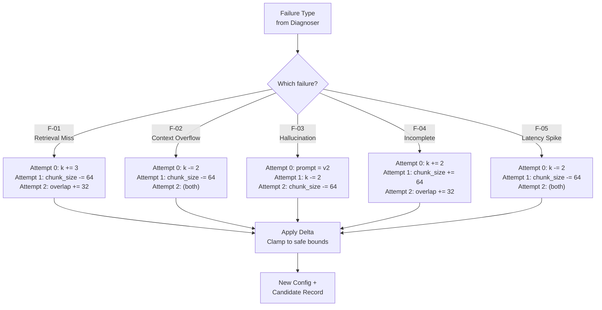

**Input:** failure_type, current config, improvement_attempt (0/1/2)

**How deltas are applied:**
- **Numeric deltas** are additive: `retrieval_k: +3` means add 3 to current value
- **String deltas** are replacements: `prompt_template: "v2"` replaces the current value
- All numeric values are **clamped** to safe bounds after applying the delta:

| Knob | Min | Max |
|------|-----|-----|
| `chunk_size` | 64 | 1024 |
| `chunk_overlap` | 0 | 128 |
| `retrieval_k` | 1 | 20 |
| `max_context_tokens` | 1000 | 8000 |

**Output:** new config, candidate record (variant_id, delta, rationale, config before/after)

```
Example: F-01 (Retrieval Miss), attempt 0:
  Delta:     { retrieval_k: +3 }
  Before:    { retrieval_k: 1, chunk_size: 64 }
  After:     { retrieval_k: 4, chunk_size: 64 }
  Rationale: "Increase retrieval breadth to capture more relevant passages"
```

**Why a static playbook?** Determinism, safety, and cost. The playbook guarantees: (a) the
same diagnosis always produces the same fix, (b) all fixes are bounded within safe ranges,
and (c) zero additional LLM calls per iteration.

---

### Complete Data Flow

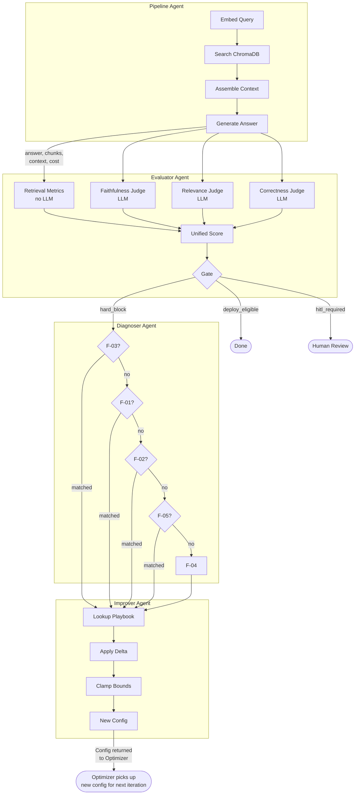

[Back to Top](#table-of-contents)

---

# Chapter 5: The Optimizer Loop

The Optimizer sits outside the graph. It invokes `graph.invoke()` repeatedly, extracting the
Improver's suggested configuration after each iteration and feeding it as the next iteration's
starting config.

### Loop Structure

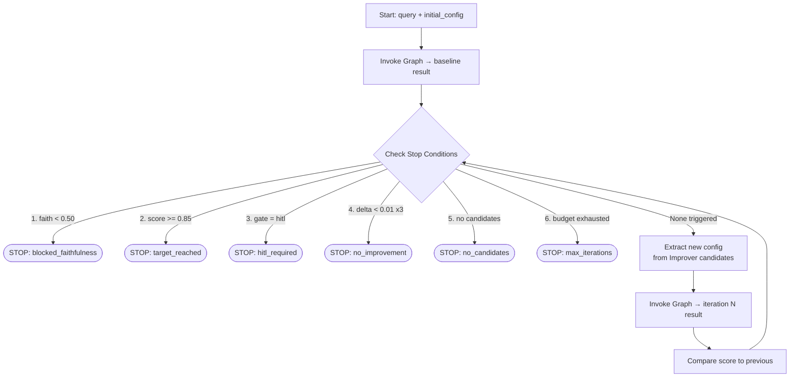

### Stop Condition Priority

Stop conditions are checked in a **safety-first** order:

1. **Faithfulness block**: a hallucinating pipeline must never be retried with a different
   retrieval config. The problem is the model, not the settings.
2. **Target reached**: success. The pipeline meets the quality bar.
3. **HITL required**: the score is in the gray band (0.70-0.85). The Optimizer cannot
   make this decision. A human reviewer must.
4. **No improvement**: three consecutive iterations with delta < 0.01 indicates the
   playbook is exhausted for this failure type.
5. **No candidates**: the Improver produced no fix. This is a defensive check and should
   not occur with the current playbook.
6. **Max iterations**: budget cap. Default is 3.

### Illustrative Example

**Starting point:** query = "How do embeddings represent meaning?"

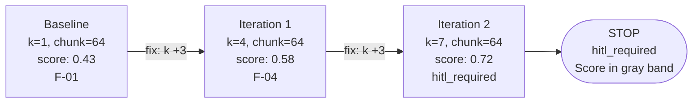

| Iteration | Config | Score | Failure | Fix Applied |
|-----------|--------|-------|---------|-------------|
| Baseline | k=1, chunk=64 | 0.43 | F-01 (Retrieval Miss) | (initial) |
| 1 | k=4, chunk=64 | 0.58 | F-04 (Answer Incomplete) | k +3 |
| 2 | k=7, chunk=64 | 0.72 | (HITL band) | k +3 |
| Stop | | | hitl_required | Score in gray band |

The Optimizer improved the score from 0.43 to 0.72 in two iterations by increasing retrieval
breadth, then stopped because the score entered the HITL band where a human reviewer must
decide.

### Before vs After

| Metric | Before | After |
|--------|--------|-------|
| Unified Score | 0.43 | 0.72 |
| Faithfulness | 1.00 | 1.00 |
| Relevance | 0.60 | 1.00 |
| Retrieval k | 1 | 7 |
| Gate Decision | hard_block | hitl_required |

### Optimizer Scope

The Optimizer adjusts retrieval and chunking configuration knobs within bounded ranges. It does
**not**:

- Modify the underlying model or fine-tune weights
- Re-train or swap embedding models
- Add new documents to the corpus
- Perform prompt engineering beyond switching between predefined prompt template versions

[Back to Top](#table-of-contents)

---

# Chapter 6: Using the Streamlit UI

The interface is organized into three tabs, each serving a distinct purpose in the workflow.

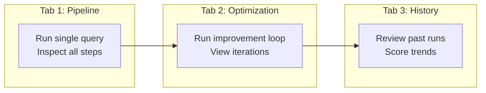

### Tab 1: Pipeline

**Purpose:** Execute a single RAG query and inspect every step of the pipeline output.

| Section | What it shows |
|---------|--------------|
| Document Selection | Select a document from the corpus or upload a new one |
| Initialize Pipeline | Ingest the document with the configured chunking strategy |
| Ask a Question | Free-text input or select from the golden dataset |
| Results | Answer, all scores (faithfulness, relevance, correctness, unified), gate decision |
| Metadata | Cost, latency, chunk count, collection name |
| Retrieved Chunks | The text chunks retrieved, with similarity scores |

**Sidebar controls** affect Tab 1: chunk strategy, chunk size, overlap, retrieval k, max
context tokens, version string, max pages to ingest.

### Tab 2: Optimization

**Purpose:** Run the self-improvement loop and observe each iteration's diagnosis and fix.

| Section | What it shows |
|---------|--------------|
| Setup | Query selection, config presets (Degraded / Default), editable config fields |
| Baseline Run | Full pipeline result with all metrics |
| Optimizer Run | Per-iteration expandable details: scores, diagnosis, fix applied, delta |
| HITL Decision | Accept or reject. Rejection triggers re-optimization |
| Before vs After | Side-by-side comparison of initial and final configs, scores, and chunks |

**Config presets:**
- **Degraded Config**: k=1, chunk_size=64, intentionally suboptimal for demonstrating improvement
- **Default Config**: k=5, chunk_size=256, baseline for the current corpus

### Tab 3: History

**Purpose:** Review historical runs and track quality trends over time.

| Section | What it shows |
|---------|--------------|
| Pipeline Queries | Past single-query runs with scores and configurations |
| Optimization Loops | Past optimizer runs with per-iteration decision chains |
| Summary Stats | Aggregate score metrics across all runs |
| Score Trend | Line chart of unified scores over time |

History is persisted in `data/runs_history.jsonl` as an append-only store. MLflow integration
for full experiment tracking is planned for Phase 3.

[Back to Top](#table-of-contents)

---

# Chapter 7: Configuration and Ingestion

### Configuration Knobs

All configuration is centralized in `config.py`. The Optimizer sweeps these knobs during the
improvement loop:

| Knob | Default | Range | What it controls |
|------|---------|-------|-----------------|
| `chunk_size` | 256 | 64 - 1024 | Token count per chunk |
| `chunk_overlap` | 0 | 0 - 128 | Overlap between consecutive chunks |
| `retrieval_k` | 5 | 1 - 20 | Number of chunks retrieved per query |
| `max_context_tokens` | 4000 | 1000 - 8000 | Token budget for assembled context |
| `prompt_template` | "v1" | v1, v2 | Generation prompt version |
| `chunk_strategy` | "fixed_size" | fixed_size, recursive_split, semantic | Chunking algorithm |

### Collection Naming

Each unique combination of version + strategy + chunk_size maps to its own ChromaDB collection:

```
rag_{version}_{strategy}_{chunk_size}

Examples:
  rag_g1_fixed_size_256    ← default config, Google embeddings
  rag_g1_fixed_size_64     ← degraded config preset
  rag_g1_fixed_size_128    ← created by Optimizer when Improver adjusts chunk_size
```

Collections are **immutable**. Once ingested, they are never modified. A new chunk_size
produces a new collection with a new name, not an update to the existing one.

### Auto-Ingest

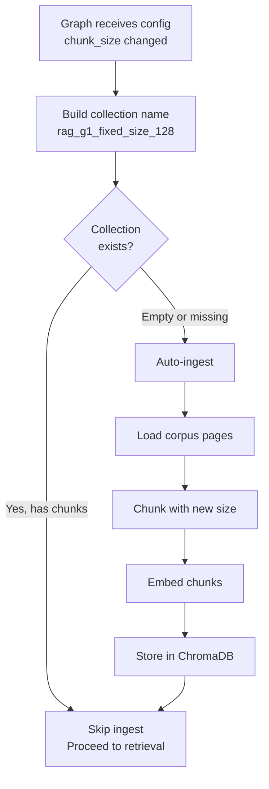

The graph pipeline auto-ingests when it encounters an empty collection. This occurs
transparently during optimizer runs when the Improver changes `chunk_size`:

1. Improver suggests `chunk_size: 128` (was 256)
2. Next graph invocation builds collection name: `rag_g1_fixed_size_128`
3. Collection does not exist → auto-ingest: load corpus → chunk at 128 → embed → store
4. Retrieval proceeds against the new collection

### Corpus

The default corpus is *Hands-On Large Language Models* by Jay Alammar. Current ingest range:

- **Start page:** 25 (skips overview/preamble content)
- **Page count:** 25 (pages 25-49)
- **Content covered:** tokenization, bag-of-words, word2vec, embeddings, RNNs, attention
  mechanisms, transformers, BERT, GPT, context windows, fine-tuning

### Golden Dataset

Seven test queries with expected answers and retrieval keywords, defined in `ground_truth.py`:

| # | Query | Key Topic |
|---|-------|-----------|
| 0 | How do embeddings represent meaning? | Embeddings, vectors, semantic similarity |
| 1 | What is the attention mechanism? | Attention, token weighting |
| 2 | What is a transformer? | Transformer architecture |
| 3 | What is tokenization? | Text splitting into tokens |
| 4 | What is a context window? | Maximum token limit |
| 5 | What is fine-tuning? | Adapting pre-trained models |
| 6 | How does word2vec generate word embeddings? | Word2vec training process |

The golden dataset serves two purposes:
1. **Correctness scoring**: the Evaluator compares the pipeline's answer to the expected answer
2. **Retrieval metrics**: keyword presence in retrieved chunks provides precision and recall

[Back to Top](#table-of-contents)

---

# Chapter 8: Troubleshooting and FAQ

### Common Issues

| Symptom | Cause | Resolution |
|---------|-------|------------|
| `429 RESOURCE_EXHAUSTED` | API rate limit exceeded (15 req/min on free tier) | Wait 60s and retry. Optimizer runs are rate-limit-intensive (4+ LLM calls per iteration). |
| Score = 0.0 on all metrics, but answer is reasonable | Judge calls failed silently due to rate limiting; scores defaulted to None | Wait for rate limit to reset and re-run the query. |
| Optimizer shows score regression | Larger chunks on a small corpus produce fewer total chunks; high k retrieves too large a fraction | Expected with small corpora. The bounds (k max=20) and max_context_tokens (4000) are the guardrails. |
| Collection has 0 chunks | Collection was deleted but not re-ingested | Tab 2 auto-ingests. For Tab 1, use "Initialize Pipeline" to trigger ingestion. |
| "I don't have enough information" answer | Retrieved chunks do not contain relevant content for the query | Verify the corpus page range covers the topic. Check against the golden dataset queries. |

### FAQ

**Q: Why is the graph linear instead of having an internal retry loop?**

The Optimizer owns retry logic externally. A linear graph is easier to debug (each invocation
is a pure function), eliminates infinite loop risks, and provides clean separation between
"evaluate once" and "decide whether to retry."

**Q: Why are there 5 failure types instead of 6?**

F-06 (Quality Drift) detects score degradation over time across production traffic. It
requires the Observer agent and live monitoring, which are planned for Phase 2. The
configuration scaffolding (`DRIFT_WINDOW`, `DRIFT_MIN_DROP`) is already in place.

**Q: Why use keyword-based retrieval metrics instead of LLM-based retrieval evaluation?**

Cost and speed. Keyword precision/recall is free, instant, and sufficient for the retrieval
component of the unified score. The LLM judges handle the more subjective assessments
(faithfulness, relevance, correctness).

**Q: What would MLflow replace in this system?**

The current JSONL-based history store (`run_history.py`). MLflow would add: experiment
grouping, SQL-queryable run history, artifact storage, a web UI for comparing runs, and a
model registry for promoting validated configurations. The core self-improving logic
(evaluate → diagnose → improve) is independent of the logging backend. MLflow integration
is planned for Phase 3.

**Q: Why does the Improver use a static playbook instead of LLM-generated fixes?**

Determinism, safety, and cost. The playbook maps each failure type to exactly 3 ordered
remediation strategies, guaranteeing: (a) identical diagnoses always produce identical fixes,
(b) all configuration changes are bounded within safe ranges, and (c) zero additional LLM
calls per improvement iteration.

**Q: What happens when the Optimizer exhausts all 3 iterations without reaching the target?**

It returns `stop_reason: "max_iterations_reached"` with the best score achieved. The full
iteration history (configs tried, scores achieved, diagnoses, fixes applied) is available
for manual review and further tuning decisions.

[Back to Top](#table-of-contents)
