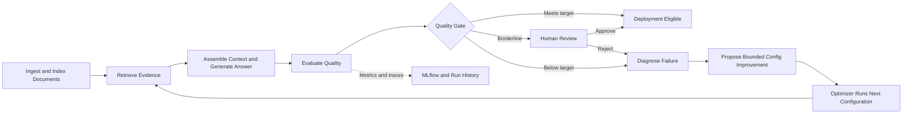
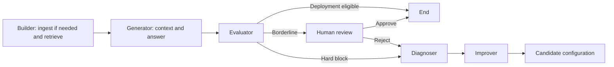
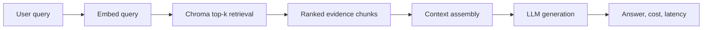
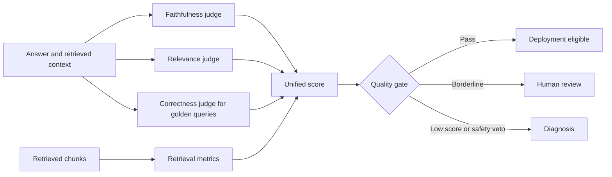
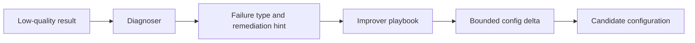
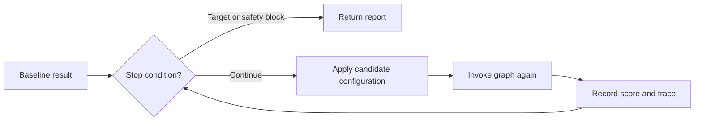

# Self-Improving RAG: Architecture and Implementation Guide

**Version:** v2.0  
**Audience:** ML/AI engineers, data engineers, and technical reviewers

---

## Contents

- [Part I: Purpose and Scope](#part-i-purpose-and-scope)
- [Part II: System Architecture](#part-ii-system-architecture)
- [Part III: Ingestion, Retrieval, and Generation](#part-iii-ingestion-retrieval-and-generation)
- [Part IV: Evaluation and Quality Gates](#part-iv-evaluation-and-quality-gates)
- [Part V: Diagnosis, Improvement, and Optimization](#part-v-diagnosis-improvement-and-optimization)
- [Part VI: Observability and Operations](#part-vi-observability-and-operations)
- [Part VII: Configuration, Corpus, and Roadmap](#part-vii-configuration-corpus-and-roadmap)

---

# Part I: Purpose and Scope

## 1.1 Problem Statement

A RAG (Retrieval-Augmented Generation) pipeline answers questions by retrieving
relevant text from documents and passing it to a language model to generate a
grounded answer. Getting one working is easy. Getting one that retrieves the
right passages, does not hallucinate, and stays reliable normally takes manual
tuning.

Self-Improving RAG automates that tuning loop. It ingests and indexes documents,
retrieves evidence, generates an answer, evaluates the result, diagnoses why it
underperformed, proposes a bounded configuration improvement, and evaluates the
next configuration.

The project does not deploy infrastructure or fine-tune models. A passing result
is marked **deployment eligible**: it met the quality gate and can progress to a
deployment workflow outside this learning project.

## 1.2 Design Goals

- Reproduce retrieval experiments through versioned Chroma collections.
- Separate one pipeline evaluation from multi-iteration optimization.
- Make scores, evidence, and failure diagnoses inspectable.
- Use deterministic, bounded configuration changes.
- Preserve human review for borderline outcomes.

## 1.3 Current Scope

The active corpus contains 10 Canadian workplace-policy documents and 23 golden
questions. The golden set includes single-source, two-source, and three-source
questions to test retrieval breadth.

Implemented capabilities include ingestion, dense Chroma retrieval, context
assembly, answer generation, LLM-based evaluation, quality gates, human review,
diagnosis, configuration improvement, bounded optimization, Streamlit inspection,
JSONL history, and MLflow experiment tracking.

---

# Part II: System Architecture

## 2.1 Two Execution Layers

The system has two execution layers:

1. **Single evaluation run:** a LangGraph workflow retrieves evidence, generates
   an answer, evaluates it, and optionally proposes a configuration change.
2. **Optimization loop:** an external service invokes the workflow again with the
   candidate configuration from the prior result.



The self-improvement loop uses evaluation results to trigger an observable
diagnosis and a bounded configuration experiment, reducing the need for
unstructured manual tuning.

## 2.2 Runtime Components

| Component | Implementation | Responsibility |
|---|---|---|
| Ingestor | `ingest.py` | Loads documents, chunks them, embeds chunks, and writes versioned collections. |
| Builder | `agents/builder.py` | Ensures the requested collection exists, then retrieves evidence. |
| Retriever | `retrieval/search.py` | Embeds a query and returns the top-$k$ Chroma chunks. |
| Generator | `agents/graph.py`, `generation/` | Assembles context and generates an answer. |
| Evaluator | `agents/evaluator.py` | Scores quality and returns a gate decision. |
| HITL | `agents/graph.py` | Pauses a borderline graph run for approval or rejection. |
| Diagnoser | `agents/diagnoser.py` | Identifies the main failure mode. |
| Improver | `agents/improver.py` | Produces one safe configuration candidate. |
| Optimizer | `agents/optimizer.py` | Coordinates bounded repeated graph invocations. |
| Observability | `agents/trace.py`, `agents/mlflow_logger.py`, `run_history.py` | Records traces, experiments, and local history. |

## 2.3 Single-Run Graph

The graph is intentionally linear. The Optimizer, not LangGraph, owns retries.



This structure makes every graph invocation independently inspectable and avoids
an unbounded circular workflow.

---

# Part III: Ingestion, Retrieval, and Generation

## 3.1 Ingestor

The Ingestor makes documents searchable:

1. Load each selected `.txt` or `.pdf` document.
2. Apply the configured chunking strategy.
3. Embed all chunks in a batch.
4. Store vectors, text, source metadata, and deterministic chunk IDs in Chroma.

Documents are chunked independently; content from different source documents is
never blended into one chunk.


## 3.2 Versioned Collections

The collection name is constructed by `build_collection_name()`:

```text
rag_{version}_{strategy}_{chunk_size}_o{chunk_overlap}
```

For example:

```text
rag_g1_fixed_size_256_o0
rag_g1_fixed_size_192_o32
```

Changing chunking strategy, size, overlap, or version selects a different
collection. If the collection is empty, the Builder triggers ingestion before
retrieval. This keeps before/after optimization experiments reproducible.

## 3.3 Retriever

The Retriever embeds the user question and asks Chroma for its top-$k$ nearest
chunks. `retrieval_k` is the number of chunks returned by the vector store.

The current implementation uses single-stage dense retrieval. Every result
includes text, similarity score, chunk ID, source file, and chunk index.

## 3.4 Generator

The Generator has two responsibilities:

1. `assemble_context()` selects the highest-scoring chunks within
   `max_context_tokens`.
2. `generate()` sends the assembled context and original question to the LLM.

It returns the answer plus generation latency and cost. It does not ingest or
retrieve documents; that separation makes evidence-selection issues distinct
from answer-generation issues.



---

# Part IV: Evaluation and Quality Gates

## 4.1 Evaluation Signals

| Signal | Method | Availability |
|---|---|---|
| Retrieval score | Keyword precision and recall over retrieved chunks | Golden queries only |
| Faithfulness | LLM judge checks answer claims against context | All queries |
| Relevance | LLM judge checks whether the answer addresses the question | All queries |
| Correctness | LLM judge compares answer with expected answer | Golden queries only |
| Latency and cost | Generation metadata | All queries |

Ad-hoc queries have no ground-truth answer or retrieval keywords. The system does
not fabricate unavailable evaluation signals.



## 4.2 Unified Score

Quality combines correctness and relevance:

```text
quality = 0.6 * correctness + 0.4 * relevance
```

When correctness is unavailable, quality falls back to relevance.

```text
score = 0.25 * retrieval
      + 0.35 * quality
      + 0.25 * faithfulness
      - 0.10 * min(latency_ms / 3000, 1)
      - 0.05 * min(cost_usd / 0.01, 1)
```

When a positive signal is unavailable, available positive weights are
re-normalized to $0.85$. The latency and cost penalty budgets remain unchanged.

## 4.3 Gate Decisions

| Condition | Gate decision | Outcome |
|---|---|---|
| Faithfulness below $0.50$ | `hard_block` | Safety veto. |
| Unified score at least $0.85$ | `deploy_eligible` | Meets the quality target. |
| Unified score from $0.70$ to below $0.85$ | `hitl_required` | Human approval or rejection. |
| Unified score below $0.70$ | `hard_block` | Diagnose and propose a change. |

Faithfulness is checked first. A fluent answer with unsupported claims is not
eligible for deployment.

---

# Part V: Diagnosis, Improvement, and Optimization

## 5.1 Failure Taxonomy

The Diagnoser is a deterministic cascade. Explicit abstentions are handled
first: no evidence is a retrieval miss, while an abstention despite relevant
evidence is an incomplete answer.

| Priority | Code | Failure | Primary signal | Typical response |
|---|---|---|---|---|
| 1 | F-01 / F-04 | Explicit abstention | No evidence or relevant evidence unused | Broaden retrieval or improve context. |
| 2 | F-03 | Hallucination | Faithfulness below $0.50$ | Strengthen grounding and evidence coverage. |
| 3 | F-01 | Retrieval Miss | Retrieval score below $0.30$ | Retrieve more or use finer chunks. |
| 4 | F-02 | Context Overflow | Context at least 95% of budget | Reduce evidence volume or adjust budget. |
| 5 | F-05 | Latency Spike | Generation latency above 3000 ms | Reduce retrieval/context work. |
| 6 | F-04 | Answer Incomplete | Remaining low-quality result | Improve coverage or context coherence. |

The Diagnoser returns a failure code, confidence, remediation hint, and a
human-readable root-cause explanation.

## 5.2 Improver

The Improver selects one candidate from a predefined playbook. It makes no LLM
call and cannot make unbounded changes.

| Failure | Typical first adjustment |
|---|---|
| F-01 Retrieval Miss | Increase `retrieval_k`. |
| F-02 Context Overflow | Reduce `retrieval_k`. |
| F-03 Hallucination | Use prompt template `v2` and increase `retrieval_k`. |
| F-04 Answer Incomplete | Increase `retrieval_k`. |
| F-05 Latency Spike | Reduce `retrieval_k`. |

Later attempts can adjust `chunk_size`, `chunk_overlap`, and prompt template.
All changes are clamped to safe bounds.



## 5.3 Optimizer

The Optimizer records the baseline as iteration 0 and repeatedly invokes the
graph with an improved configuration. It stops on target reached, faithfulness
block, a new HITL result, no candidate, sustained lack of improvement, or the
iteration budget.

A Playground baseline preserves the exact query, configuration, and collection
version that produced it. An explicitly rejected borderline baseline can continue
into an optimization iteration.



---

# Part VI: Observability and Operations

## 6.1 Streamlit Interface

| View | Purpose |
|---|---|
| Test Playground | Ingest/select a collection, run queries, inspect answers, scores, chunks, and traces. |
| Optimizer | Start from a golden or custom query and inspect each configuration iteration. |
| History | Review JSONL-backed query and optimization records. |

Golden queries receive correctness scoring. Custom queries still receive
faithfulness, relevance, latency, cost, and applicable retrieval evaluation.

## 6.2 Execution Traces and MLflow

Structured trace events capture major pipeline stages. MLflow logs query and
optimization parameters, metrics, and spans as a parallel experiment view.
JSONL history remains the lightweight local history store.

Start MLflow with SQLite:

```bash
.venv/bin/mlflow ui \
  --backend-store-uri sqlite:///mlflow.db \
  --default-artifact-root ./mlartifacts \
  --port 5000
```

Start Streamlit with the same tracking URI:

```bash
export MLFLOW_TRACKING_URI=sqlite:///mlflow.db
.venv/bin/streamlit run frontend/app.py
```

Open `http://localhost:5000` for MLflow. If the server is unavailable, the
application continues and skips MLflow logging.

## 6.3 Embedding Quotas

A changed chunking configuration creates a new collection and re-embeds the
corpus. Repeated optimizer experiments can exhaust a provider's embedding quota.
For a compact demo, use fewer iterations and adjust `retrieval_k` before changing
chunk settings.

---

# Part VII: Configuration, Corpus, and Roadmap

## 7.1 Active Configuration

| Knob | Default | Purpose |
|---|---:|---|
| `chunk_strategy` | `fixed_size` | Fixed-size, recursive, or semantic chunking. |
| `chunk_size` | 256 | Target chunk size. |
| `chunk_overlap` | 0 | Shared content between adjacent chunks. |
| `retrieval_k` | 5 | Number of Chroma results returned. |
| `max_context_tokens` | 4000 | Context assembly token budget. |
| `prompt_template` | `v1` | Generation prompt version. |

## 7.2 Golden Dataset

`ground_truth.py` is the authoritative golden dataset. Its comments identify
medium and hard cross-document tests and their required sources. Use a low
`retrieval_k` setting to demonstrate a retrieval miss, then compare the next
Optimizer configuration.

## 7.3 Planned Phase 2 Enhancements

The following are not active stages in the current pipeline:

- Query Rewriter for ambiguous or underspecified questions
- Hybrid search combining keyword and dense retrieval
- Reranking before context assembly
- Context compression for large evidence sets
- Quality drift detection across sustained production traffic

These features add retrieval-quality levers after the existing evaluation and
optimization loop has been validated.
